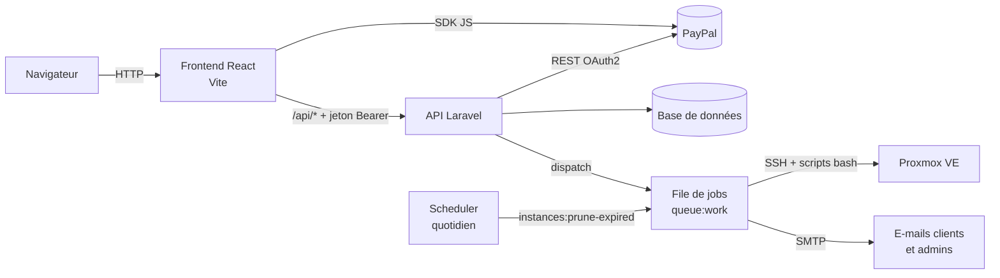

# HostBuster — Hébergement Cloud (ELVCorp)

HostBuster est une plateforme d'hébergement d'applications à la demande. Un client choisit une application (WordPress, GLPI, Odoo, Minecraft…), sélectionne une offre (CPU / RAM / stockage), paie via PayPal, et un conteneur est automatiquement déployé sur un hyperviseur **Proxmox VE**. Il peut ensuite suivre ses instances, passer à une offre supérieure ou les supprimer depuis son espace client.

Le dépôt contient deux applications :

| Dossier | Rôle | Stack |
|---|---|---|
| [`/`](.) (racine) | Frontend — site vitrine et espace client | React 19, TypeScript, Vite, React Router, Tailwind (CDN), PayPal JS SDK |
| [`backend/`](backend) | API REST, paiements, file de jobs, pilotage Proxmox | Laravel 13, PHP 8.3, Sanctum, SQLite/MySQL |

> La documentation détaillée de l'API se trouve dans [backend/README.md](backend/README.md).

---

## Sommaire

- [HostBuster — Hébergement Cloud (ELVCorp)](#hostbuster--hébergement-cloud-elvcorp)
  - [Sommaire](#sommaire)
  - [Fonctionnalités](#fonctionnalités)
  - [Architecture](#architecture)
  - [Prérequis](#prérequis)
    - [Installer Node.js 22 avec nvm](#installer-nodejs-22-avec-nvm)
  - [Installation rapide](#installation-rapide)
  - [Configuration du frontend](#configuration-du-frontend)
  - [Scripts npm](#scripts-npm)
  - [Structure du frontend](#structure-du-frontend)
  - [Pages et routes](#pages-et-routes)
  - [Déploiement en production](#déploiement-en-production)

---

## Fonctionnalités

- **Catalogue** : applications disponibles (WordPress, GLPI, Odoo, Minecraft Java Edition) avec plusieurs offres de ressources.
- **Comptes utilisateurs** : inscription (mot de passe robuste imposé), connexion par jeton, modification du profil, suppression du compte.
- **Mot de passe oublié** : envoi d'un lien de réinitialisation par e-mail.
- **Commande & paiement** : paiement PayPal, choix d'un nom d'instance unique.
- **Déploiement automatique** : création du conteneur sur Proxmox en arrière-plan, e-mail de confirmation (ou d'échec).
- **Gestion des instances** : liste, statut, adresse IP/port, suppression.
- **Upgrade** : passage à une offre supérieure (payant), sans possibilité de downgrade.
- **Expiration automatique** : les instances sont supprimées après 30 jours (configurable).
- **Support** : formulaire de contact envoyé par e-mail aux administrateurs, FAQ.
- **Pages légales** : CGU, CGV, mentions légales.

## Architecture



Parcours d'une commande :

1. Le client choisit une application, une offre et un nom d'instance.
2. Le frontend appelle `POST /api/orders` → le backend crée la commande PayPal.
3. Le client valide le paiement dans la fenêtre PayPal.
4. Le frontend appelle `POST /api/orders/{id}/capture` → le backend capture le paiement, crée l'instance (`provisioning`) et place un `DeployInstanceJob` en file.
5. Le worker exécute le script de déploiement sur Proxmox, met à jour l'instance (`running`, IP, port) et envoie un e-mail.

## Prérequis

- **Node.js 22** (et npm)
- **PHP 8.3** + **Composer** (pour le backend)
- Un compte développeur **PayPal** (identifiants sandbox pour le développement)
- Pour le déploiement réel des instances : un serveur **Proxmox VE** accessible en SSH

### Installer Node.js 22 avec nvm

```bash
curl -o- https://raw.githubusercontent.com/nvm-sh/nvm/v0.39.7/install.sh | bash
```

Ajouter à la fin de `~/.zshrc` (ou `~/.bashrc`) :

```bash
export NVM_DIR="$HOME/.nvm"
[ -s "$NVM_DIR/nvm.sh" ] && \. "$NVM_DIR/nvm.sh"
[ -s "$NVM_DIR/bash_completion" ] && \. "$NVM_DIR/bash_completion"
```

Puis :

```bash
source ~/.zshrc
nvm install 22
nvm use 22
nvm alias default 22
```

## Installation rapide

```bash
git clone git@github.com:LeoB42490/ELVCorp.git
cd ELVCorp
```

**1. Backend** (voir [backend/README.md](backend/README.md) pour le détail) :

```bash
cd backend
composer setup
php artisan serve          # API sur http://localhost:8000
php artisan queue:work     # dans un second terminal
```

**2. Frontend** (depuis la racine du dépôt) :

```bash
cp .env.example .env       # puis renseigner les variables
npm install
npm run dev                # site sur http://localhost:5173
```

En développement, Vite redirige automatiquement toutes les requêtes `/api/*` vers `http://localhost:8000` (voir [vite.config.ts](vite.config.ts)) : aucune configuration CORS n'est nécessaire.

## Configuration du frontend

Les variables sont lues depuis le fichier `.env` à la racine (non versionné). Seules les variables préfixées par `VITE_` sont exposées au navigateur.

| Variable | Description | Exemple |
|---|---|---|
| `VITE_PAYPAL_CLIENT_ID` | Client ID PayPal (public) utilisé par le bouton de paiement | `AbC...xyz` |
| `VITE_PAYPAL_MODE` | Environnement PayPal | `sandbox` / `live` |
| `VITE_PAYPAL_CURRENCY` | Devise des paiements | `EUR` |
| `VITE_API_URL` | Adresse de l'API (réservée — le code utilise actuellement des URL relatives `/api`) | `http://1.2.3.4/api` |

> ⚠️ Le Client ID PayPal doit correspondre au même environnement (sandbox/live) que celui configuré côté backend.

## Scripts npm

| Commande | Description |
|---|---|
| `npm run dev` | Serveur de développement avec rechargement à chaud |
| `npm run build` | Vérification TypeScript puis build de production dans `dist/` |
| `npm run preview` | Sert localement le build de production |
| `npm run lint` | Analyse ESLint |

## Structure du frontend

```
.
├── index.html              # Point d'entrée HTML (charge Tailwind via CDN)
├── public/                 # Fichiers statiques servis tels quels (favicon, icônes)
├── src/
│   ├── main.tsx            # Montage de l'application React
│   ├── App.tsx             # Déclaration des routes
│   ├── api.tsx             # Fonctions d'appel à l'API (auth, profil, upgrades…)
│   ├── components/         # Navbar, Footer, boutons PayPal
│   ├── pages/              # Une page = un écran du site
│   └── assets/             # Images (logos des applications, illustrations)
├── vite.config.ts          # Config Vite + proxy /api
└── eslint.config.js
```

L'authentification repose sur un jeton **Laravel Sanctum** stocké dans le `localStorage` (clé `token`) et transmis dans l'en-tête `Authorization: Bearer <token>`.

## Pages et routes

| Route | Page | Accès |
|---|---|---|
| `/` | Accueil et catalogue des applications | Public |
| `/offers/:id` | Offres d'une application + commande | Public (paiement connecté) |
| `/register` | Inscription | Public |
| `/login` | Connexion | Public |
| `/mot-de-passe-oublie` | Demande de réinitialisation | Public |
| `/reset-password` | Saisie du nouveau mot de passe (lien reçu par e-mail) | Public |
| `/profil` | Profil utilisateur, suppression du compte | Connecté |
| `/instances` | Liste et gestion des instances | Connecté |
| `/instances/:id/upgrade` | Passage à une offre supérieure | Connecté |
| `/support` | Formulaire de contact | Connecté |
| `/faq` | Questions fréquentes | Public |
| `/cgu`, `/cgv`, `/mentions-legales` | Pages légales | Public |

## Déploiement en production

1. Construire le frontend :
   ```bash
   npm ci
   npm run build
   ```
2. Servir le dossier `dist/` avec un serveur web (Nginx, Apache…) en redirigeant toutes les routes inconnues vers `index.html` (application monopage).
3. Rediriger `/api/*` vers le backend Laravel sur le même domaine, afin que les URL relatives du frontend fonctionnent.

Exemple de configuration Nginx :

```nginx
server {
    listen 80;
    server_name exemple.fr;

    root /var/www/elvcorp/dist;
    index index.html;

    location /api/ {
        proxy_pass http://127.0.0.1:8000;
        proxy_set_header Host $host;
        proxy_set_header X-Forwarded-For $proxy_add_x_forwarded_for;
    }

    location / {
        try_files $uri $uri/ /index.html;
    }
}
```

Le déploiement du backend (worker de file, scheduler, clés SSH Proxmox) est décrit dans [backend/README.md](backend/README.md#déploiement-en-production).
