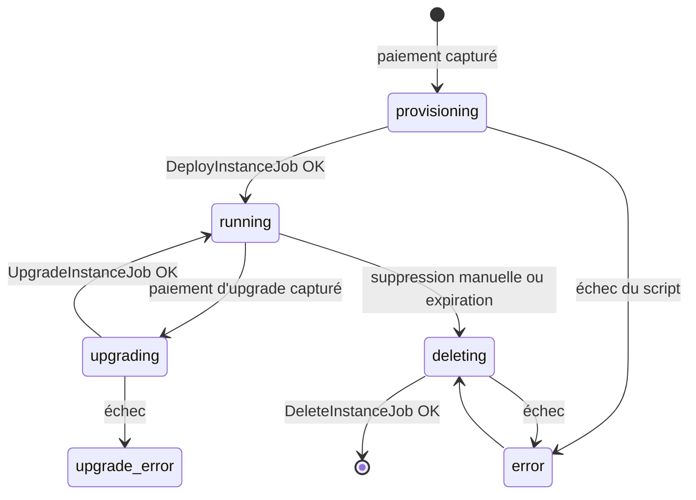

# HostBuster — Backend (API Laravel)

API REST de la plateforme HostBuster. Elle gère les comptes utilisateurs, le catalogue d'applications et d'offres, les paiements PayPal, puis pilote le déploiement, la mise à niveau et la suppression des conteneurs sur **Proxmox VE** à l'aide de jobs en file d'attente.

> Le frontend React et la vue d'ensemble du projet sont décrits dans le [README principal](../README.md).

**Stack :** PHP 8.3 · Laravel 13 · Laravel Sanctum 4 (jetons API) · SQLite (dev) / MySQL (prod) · PayPal REST API · SSH vers Proxmox

---

## Sommaire

- [HostBuster — Backend (API Laravel)](#hostbuster--backend-api-laravel)
  - [Sommaire](#sommaire)
  - [Prérequis](#prérequis)
  - [Installation](#installation)
    - [Alimenter le catalogue](#alimenter-le-catalogue)
  - [Lancer en développement](#lancer-en-développement)
  - [Configuration (.env)](#configuration-env)
    - [Application](#application)
    - [Base de données et file d'attente](#base-de-données-et-file-dattente)
    - [PayPal](#paypal)
    - [Proxmox et instances](#proxmox-et-instances)
    - [E-mails](#e-mails)
  - [Structure du projet](#structure-du-projet)
  - [Modèle de données](#modèle-de-données)
  - [Référence de l'API](#référence-de-lapi)
    - [Authentification et compte](#authentification-et-compte)
    - [Catalogue](#catalogue)
    - [Commandes et paiement](#commandes-et-paiement)
    - [Instances](#instances)
    - [Divers](#divers)
  - [Cycle de vie d'une instance](#cycle-de-vie-dune-instance)
  - [Intégration Proxmox](#intégration-proxmox)
  - [E-mails](#e-mails-1)
  - [Tâches planifiées](#tâches-planifiées)
  - [Tests et qualité](#tests-et-qualité)
  - [Déploiement en production](#déploiement-en-production)
  - [Dépannage](#dépannage)

---

## Prérequis

- PHP **8.3** avec les extensions `pdo_sqlite` (ou `pdo_mysql`), `mbstring`, `openssl`, `curl`, `xml`
- [Composer](https://getcomposer.org/)
- Node.js 22 + npm (uniquement pour les assets de la page d'accueil Laravel)
- Un client `ssh` et une clé autorisée sur le serveur Proxmox (pour déployer de vraies instances)

## Installation

```bash
cd backend
composer setup
```

Le script `composer setup` enchaîne :

1. `composer install`
2. copie de `.env.example` vers `.env` (si absent)
3. `php artisan key:generate`
4. `php artisan migrate --force`
5. `npm install` puis `npm run build`

Pour une installation manuelle :

```bash
composer install
cp .env.example .env
php artisan key:generate
touch database/database.sqlite   # si DB_CONNECTION=sqlite
php artisan migrate
```

### Alimenter le catalogue

Les tables `applications`, `offers` et `application_offers` ne sont pas remplies par un seeder : il faut y insérer les applications et les offres (par exemple via `php artisan tinker`).

```php
$app   = App\Models\Application::create(['name' => 'WordPress', 'docker_image' => 'wordpress', 'is_active' => true]);
$offer = App\Models\Offers::create(['name' => 'Standard', 'cpu' => 1, 'ram_mb' => 1024, 'storage_gb' => 10, 'price' => 9.99]);
App\Models\ApplicationOffer::create(['application_id' => $app->id, 'offer_id' => $offer->id]);
```

> Le nom de l'application doit correspondre à un script de déploiement connu (voir [Intégration Proxmox](#intégration-proxmox)) : `WordPress`, `GLPI`, `Odoo` ou `Minecraft Java Edition`.

## Lancer en développement

Tout-en-un (serveur, worker de file, logs en direct et Vite) :

```bash
composer dev
```

Ou séparément, dans plusieurs terminaux :

```bash
php artisan serve             # API sur http://localhost:8000
php artisan queue:listen      # exécute les jobs de déploiement
php artisan pail              # logs en temps réel
```

Vérifier que l'API répond :

```bash
curl http://localhost:8000/api/test
```

> ⚠️ Sans worker de file (`queue:listen` ou `queue:work`), les commandes sont payées mais les instances restent bloquées en statut `provisioning`.

## Configuration (.env)

Seules les variables propres au projet sont listées ici ; les autres sont les variables standard de Laravel.

### Application

| Variable | Description | Exemple |
|---|---|---|
| `APP_NAME` | Nom de l'application | `HostBuster` |
| `APP_ENV` / `APP_DEBUG` | Environnement et mode debug | `production` / `false` |
| `APP_URL` | URL publique de l'API | `https://exemple.fr` |
| `FRONTEND_URL` | URL du frontend, utilisée par défaut dans les liens de réinitialisation du mot de passe | `https://exemple.fr` |
| `APP_LOCALE` | Langue des messages de validation (traductions dans `lang/fr`) | `fr` |

### Base de données et file d'attente

| Variable | Description | Exemple |
|---|---|---|
| `DB_CONNECTION` | Pilote de base de données | `sqlite` / `mysql` |
| `DB_HOST`, `DB_PORT`, `DB_DATABASE`, `DB_USERNAME`, `DB_PASSWORD` | Connexion MySQL | — |
| `QUEUE_CONNECTION` | Pilote de file (les jobs sont stockés en base) | `database` |
| `DB_QUEUE_RETRY_AFTER` | Délai (s) avant qu'un job soit considéré bloqué. Doit être **supérieur** au timeout des jobs (600 s) | `900` |

### PayPal

| Variable | Description | Exemple |
|---|---|---|
| `PAYPAL_MODE` | Environnement | `sandbox` / `live` |
| `PAYPAL_CLIENT_ID` | Client ID de l'application PayPal | — |
| `PAYPAL_CLIENT_SECRET` | Secret de l'application PayPal | — |
| `PAYPAL_BASE_URL` | URL de l'API PayPal | `https://api-m.sandbox.paypal.com` (sandbox) / `https://api-m.paypal.com` (live) |
| `PAYPAL_CURRENCY` | Devise (facultatif) | `EUR` |

### Proxmox et instances

| Variable | Description | Exemple |
|---|---|---|
| `PROXMOX_HOST` | Adresse du serveur Proxmox joignable en SSH | `10.0.0.10` |
| `PROXMOX_PUBLIC_IP` | IP publique renvoyée au client si le script ne fournit pas d'adresse IPv6 | `203.0.113.5` |
| `INSTANCE_DEFAULT_TTL_DAYS` | Durée de vie d'une instance avant suppression automatique (jours) | `30` |

### E-mails

| Variable | Description | Exemple |
|---|---|---|
| `MAIL_MAILER` | `log` en dev (e-mails écrits dans `storage/logs`), `smtp` en prod | `smtp` |
| `MAIL_HOST`, `MAIL_PORT`, `MAIL_USERNAME`, `MAIL_PASSWORD`, `MAIL_SCHEME` | Serveur SMTP | — |
| `MAIL_FROM_ADDRESS`, `MAIL_FROM_NAME` | Expéditeur | `noreply@exemple.fr` |
| `ADMIN_EMAILS` | Adresses des administrateurs, séparées par des virgules. Destinataires des demandes de support et en copie cachée des e-mails d'instance | `admin@exemple.fr,support@exemple.fr` |

> `ADMIN_EMAILS` n'est pas présent dans `.env.example` mais il est **obligatoire** : sans lui, le formulaire de support renvoie une erreur 500.

## Structure du projet

```
backend/
├── app/
│   ├── Console/Commands/
│   │   └── PruneExpiredInstances.php   # Suppression des instances expirées
│   ├── Http/Controllers/
│   │   ├── ApplicationOfferController.php  # Catalogue
│   │   ├── OrderController.php         # Commandes & paiements PayPal
│   │   ├── InstanceController.php      # Liste, suppression, upgrades
│   │   ├── PasswordResetController.php # Mot de passe oublié
│   │   └── SupportController.php       # Formulaire de support
│   ├── Jobs/
│   │   ├── DeployInstanceJob.php       # Création du conteneur
│   │   ├── UpgradeInstanceJob.php      # Augmentation des ressources
│   │   └── DeleteInstanceJob.php       # Suppression du conteneur
│   ├── Mail/                           # E-mails transactionnels
│   ├── Models/                         # User, Application, Offers, ApplicationOffer, Order, Instance
│   ├── Notifications/                  # E-mail de réinitialisation du mot de passe
│   └── Services/
│       ├── PayPalService.php           # Appels à l'API PayPal
│       └── ProxmoxDeployService.php    # Exécution des scripts Proxmox via SSH
├── config/
│   ├── instances.php                   # Durée de vie des instances
│   └── services.php                    # Identifiants PayPal
├── database/migrations/
├── lang/fr/                            # Traductions françaises
├── resources/views/emails/             # Gabarits HTML et texte des e-mails
└── routes/
    ├── api.php                         # Routes de l'API (préfixe /api)
    └── console.php                     # Tâches planifiées
```

## Modèle de données

```mermaid
erDiagram
    users ||--o{ instances : possède
    users ||--o{ orders : passe
    applications ||--o{ application_offers : propose
    offers ||--o{ application_offers : "est proposée pour"
    application_offers ||--o{ instances : "plan actuel"
    application_offers ||--o{ orders : "plan acheté"
    instances ||--o{ orders : "upgrades"

    users { id nom prenom email password }
    applications { id name description docker_image is_active }
    offers { id name cpu ram_mb storage_gb price is_active }
    application_offers { id application_id offer_id }
    orders { id user_id application_offer_id instance_name amount status type instance_id source_application_offer_id paypal_order_id paypal_capture_id }
    instances { id user_id application_offer_id name status ip_address port proxmox_ctid expires_at }
```

- **`application_offers`** associe une application à une offre : c'est le « plan » réellement acheté.
- **`orders.type`** vaut `purchase` (nouvelle instance) ou `upgrade`. Pour un upgrade, `source_application_offer_id` mémorise le plan de départ.
- **`orders.status`** : `pending` → `paid` ou `failed`.

## Référence de l'API

Toutes les routes sont préfixées par `/api`. Les requêtes doivent envoyer `Accept: application/json`.
Les routes marquées 🔒 exigent l'en-tête `Authorization: Bearer <token>`, le jeton étant renvoyé par `/register` ou `/login`.

### Authentification et compte

| Méthode | Route | | Description |
|---|---|---|---|
| `POST` | `/register` | | Crée un compte (`nom`, `prenom`, `email`, `password`) et renvoie un jeton |
| `POST` | `/login` | | Connexion (`email`, `password`), renvoie un jeton |
| `POST` | `/logout` | 🔒 | Révoque le jeton courant |
| `GET` | `/me` | 🔒 | Utilisateur connecté |
| `PUT` | `/me` | 🔒 | Met à jour `nom`, `prenom`, `email` |
| `DELETE` | `/me` | 🔒 | Supprime le compte — refusé (409) tant que des instances existent |
| `POST` | `/mot-de-passe-oublie` | | Envoie le lien de réinitialisation (`email`, `frontend_url`) |
| `POST` | `/reset-password` | | Change le mot de passe (`token`, `email`, `password`, `password_confirmation`) |

Règle du mot de passe à l'inscription : au moins 8 caractères, avec une majuscule, une minuscule, un chiffre et un caractère spécial (`@$!%*?&`).

### Catalogue

| Méthode | Route | | Description |
|---|---|---|---|
| `GET` | `/applications/{id}/offers` | | Application active et ses offres actives, triées par prix |

### Commandes et paiement

| Méthode | Route | | Description |
|---|---|---|---|
| `POST` | `/orders` | 🔒 | Crée une commande et la commande PayPal (`application_id`, `offer_id`, `instance_name`) |
| `POST` | `/orders/{order}/capture` | 🔒 | Capture le paiement, crée l'instance et lance le déploiement |
| `POST` | `/upgrade-orders` | 🔒 | Crée une commande d'upgrade (`instance_id`, `application_offer_id`) |
| `POST` | `/upgrade-orders/{order}/capture` | 🔒 | Capture le paiement et lance l'upgrade |

Contraintes sur `instance_name` : 3 à 30 caractères, minuscules, chiffres et tirets (`mon-site-01`), unique.

Règles d'upgrade : même application uniquement, aucune ressource inférieure à l'offre actuelle, et le prix payé est le **prix complet** du nouveau plan.

### Instances

| Méthode | Route | | Description |
|---|---|---|---|
| `GET` | `/instances` | 🔒 | Instances de l'utilisateur |
| `DELETE` | `/instances/{id}` | 🔒 | Lance la suppression (réponse `202`) |
| `GET` | `/instances/{id}/upgrades` | 🔒 | Offre actuelle et offres supérieures disponibles |

### Divers

| Méthode | Route | | Description |
|---|---|---|---|
| `POST` | `/support` | 🔒 | Envoie une demande aux administrateurs (`subject` 5-150 car., `message` 10-5000 car.) |
| `GET` | `/test` | | Vérifie que l'API répond |
| `GET` | `/up` | | Health check Laravel (hors préfixe `/api`) |

Les erreurs de validation renvoient un code `422` avec les messages en français dans `errors`.

## Cycle de vie d'une instance



Chaque transition vers `running`, `error`, `upgrade_error` ou la suppression déclenche un e-mail au client (avec les administrateurs en copie cachée).

| Job | Déclenché par | Action Proxmox |
|---|---|---|
| `DeployInstanceJob` | Capture d'une commande | Exécute le script de l'application, récupère VMID, IP et port |
| `UpgradeInstanceJob` | Capture d'une commande d'upgrade | Exécute `upgrade_instance.bash` avec les nouvelles ressources |
| `DeleteInstanceJob` | `DELETE /instances/{id}` ou expiration | Exécute `suppr_container`, puis supprime la ligne en base (3 tentatives, timeout 600 s) |

## Intégration Proxmox

`App\Services\ProxmoxDeployService` se connecte en SSH à `PROXMOX_HOST` et y exécute des scripts bash :

| Action | Commande distante |
|---|---|
| Déploiement | `bash /home/script0/<application>.bash <cpu> <ram_mb> <storage_gb> <hostname>` |
| Upgrade | `sudo /home/script0/upgrade_instance.bash <vmid> <cpu> <ram_mb> <storage_gb>` |
| Suppression | `bash suppr_container <vmid>` |

Correspondance application → script :

| Nom de l'application (en base) | Script |
|---|---|
| `Minecraft Java Edition` | `/home/script0/minecraft.bash` |
| `GLPI` | `/home/script0/glpi.bash` |
| `Odoo` | `/home/script0/odoo.bash` |
| `WordPress` | `/home/script0/wordpress.bash` |

Le backend lit la sortie des scripts pour mettre à jour l'instance. Les scripts doivent donc afficher :

```text
VMID choisi : 105
Adresse IPv6 : 2001:db8::5
Port : 8080
```

Le script d'upgrade doit écrire `UPGRADE_SUCCESS` en cas de réussite. Tout code de retour non nul est traité comme un échec.

**Configuration SSH requise sur le serveur qui exécute le backend :**

- clé privée `/home/user0/.ssh/id_ed25519` lisible par l'utilisateur qui lance le worker de file ;
- clé publique autorisée pour l'utilisateur `script0` sur le serveur Proxmox ;
- droit `sudo` sans mot de passe pour `script0` sur `upgrade_instance.bash`.

> Ces chemins et noms d'utilisateur sont actuellement écrits en dur dans `ProxmoxDeployService.php`.

## E-mails

| E-mail | Destinataire | Déclencheur |
|---|---|---|
| Instance prête | Client (+ admins en Cci) | Déploiement réussi |
| Échec du déploiement | Client (+ admins en Cci) | Déploiement en erreur |
| Instance mise à niveau | Client (+ admins en Cci) | Upgrade réussi |
| Échec de la mise à niveau | Client (+ admins en Cci) | Upgrade en erreur |
| Instance supprimée | Client (+ admins en Cci) | Suppression réussie |
| Réinitialisation du mot de passe | Client | `POST /mot-de-passe-oublie` |
| `[Support HostBuster] …` | `ADMIN_EMAILS` | `POST /support` |

Les gabarits (versions HTML et texte) se trouvent dans `resources/views/emails/`. En développement, `MAIL_MAILER=log` écrit les e-mails dans `storage/logs/laravel.log`.

## Tâches planifiées

Déclarées dans [routes/console.php](routes/console.php) :

| Commande | Fréquence | Rôle |
|---|---|---|
| `instances:prune-expired` | Quotidienne | Passe en `deleting` les instances dont `expires_at` est dépassé et place un `DeleteInstanceJob` en file |

Exécution manuelle :

```bash
php artisan instances:prune-expired
```

Liste des tâches planifiées :

```bash
php artisan schedule:list
```

## Tests et qualité

```bash
composer test          # Lance PHPUnit (base SQLite en mémoire)
./vendor/bin/pint      # Formate le code selon les conventions Laravel
```

## Déploiement en production

1. **Installer les dépendances et optimiser :**
   ```bash
   composer install --no-dev --optimize-autoloader
   php artisan migrate --force
   php artisan config:cache
   php artisan route:cache
   ```
   Après toute modification du `.env`, relancer `php artisan config:cache`.

2. **Configurer le `.env`** : `APP_ENV=production`, `APP_DEBUG=false`, identifiants PayPal **live**, SMTP, `ADMIN_EMAILS`, `FRONTEND_URL`, `PROXMOX_*`.

3. **Servir l'application** via PHP-FPM et Nginx (racine web : `backend/public`), ou derrière le proxy `/api` décrit dans le [README principal](../README.md#déploiement-en-production).

4. **Garder le worker de file actif** avec Supervisor, par exemple `/etc/supervisor/conf.d/hostbuster-worker.conf` :
   ```ini
   [program:hostbuster-worker]
   command=php /var/www/elvcorp/backend/artisan queue:work --tries=3 --timeout=600
   user=user0
   autostart=true
   autorestart=true
   stopwaitsecs=660
   redirect_stderr=true
   stdout_logfile=/var/www/elvcorp/backend/storage/logs/worker.log
   ```
   L'utilisateur du worker doit pouvoir lire la clé SSH Proxmox. Après chaque mise à jour du code :
   ```bash
   php artisan queue:restart
   ```

5. **Activer le scheduler** via la crontab de l'utilisateur du backend :
   ```cron
   * * * * * cd /var/www/elvcorp/backend && php artisan schedule:run >> /dev/null 2>&1
   ```

6. **Droits d'écriture** sur `storage/` et `bootstrap/cache/` pour l'utilisateur du serveur web.

## Dépannage

| Symptôme | Piste |
|---|---|
| Instance bloquée en `provisioning` | Le worker de file ne tourne pas : `php artisan queue:work` |
| Jobs en échec | `php artisan queue:failed`, puis `php artisan queue:retry all` après correction |
| Instance en `error` | Consulter `storage/logs/laravel.log` : la commande SSH et la sortie du script y sont enregistrées |
| `Application non supportée` | Le nom en base ne correspond à aucun script (voir [Intégration Proxmox](#intégration-proxmox)) |
| Erreur 500 sur `/support` | `ADMIN_EMAILS` absent ou vide |
| Paiement refusé ou erreur PayPal | Vérifier que `PAYPAL_BASE_URL`, les identifiants backend et `VITE_PAYPAL_CLIENT_ID` du frontend pointent tous vers le même environnement |
| Changement du `.env` sans effet | `php artisan config:clear` (ou `config:cache` en prod) et `php artisan queue:restart` |
